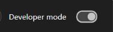
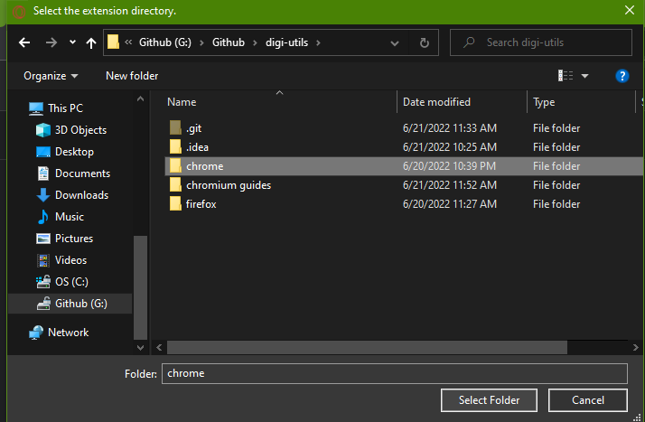

## Installation guide for:
# Opera GX 

1. Download the extension from [here](https://codeload.github.com/menga-team/digi-utils/zip/refs/heads/main).

2. unzip the file. there should be a "digi-utils" folder.

3. open Opera GX and go to: [opera://extensions](opera://extensions)

4. enable Developer mode (click the switch in the top right corner)

5. click the "Load unpacked" button (the button in the top left)

6. select the folder called "chrome" in the "digi-utils" folder (the folder in step 2)

7. click the "Select Folder" button and you are done!
